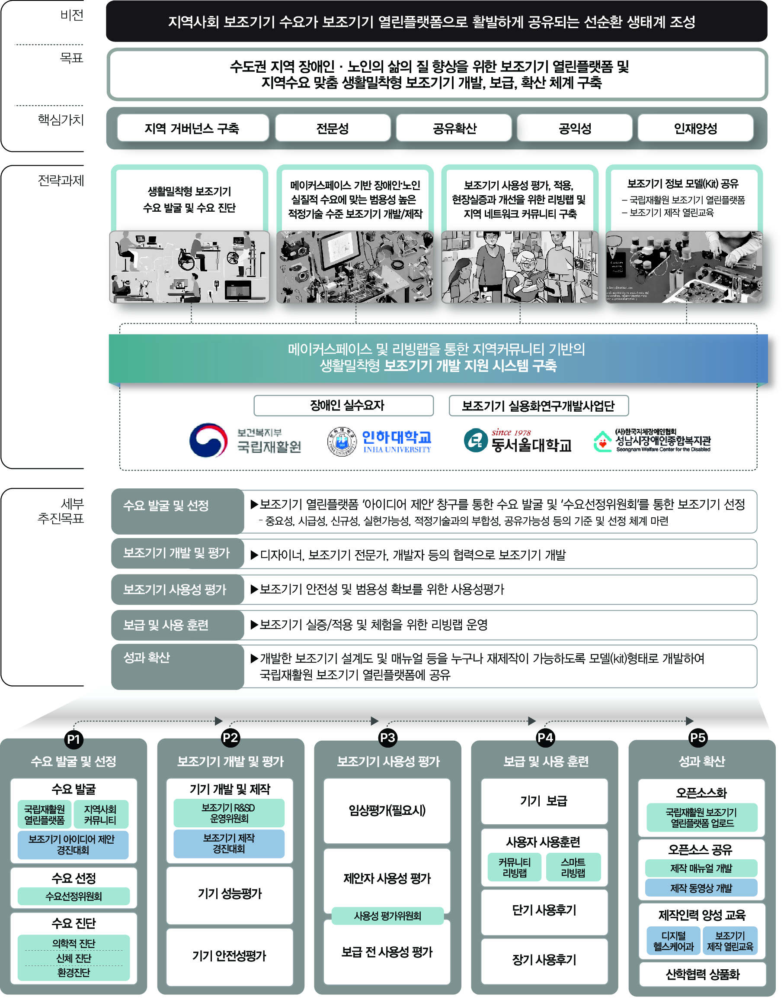
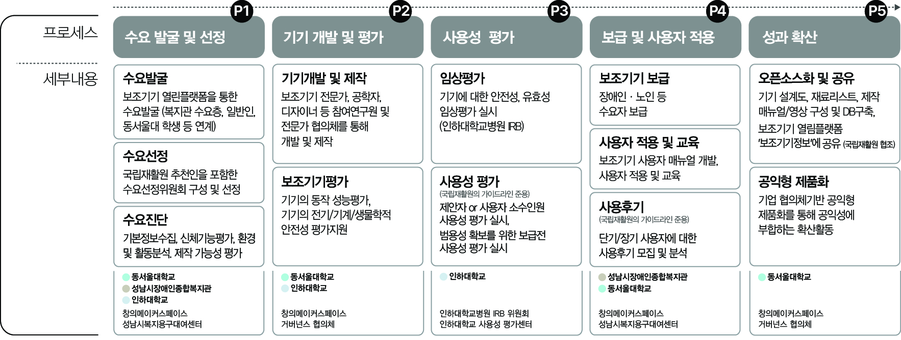

# DU_AT
환영합니다. 이 페이지는 동서울대학교, 인하대학교, 성남시장애인종합복지관이 공동으로 운영하는 지역기반 보조기기 R&amp;SD 과제의 보조기기 관리를 위해 만들어졌습니다.

## 과제 개요
  * 주관연구기관 : 동서울대학교산학협력단
  * 공동연구기관 : 인하대학교산학협력단/성남시장애인종합복지관
  * 연구기간 : 2024.04.01 - 2027.12.31
  * 주관 부처 : 보건복지부 국립재활원

## 과제 목표

## 보조기기 개발 프로세스

