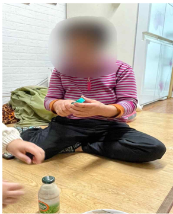
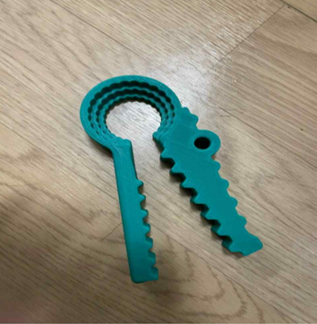
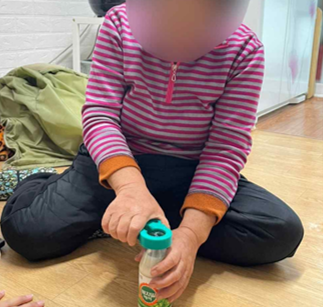

# 다용도 오프너 보조기기 사용스토리
## 보조기기 사용자
  * 이름 : OOO(여성) / 나이 : 70대
  * 신체기능
    * 정상범위
      1. 상지/하지 움직임 정상(보조기기 사용 X)
      2. 인지기능 문제 X(정상)
    * 어려움을 보이는 기능
      1. 뒷목 통증(한의원 내원)
  * 보조기기 사용환경
    * 아파트 3층
    * 거주 엘리베이터가 없어 계단 이용
    * 남편과 둘이 거주함
  * 평소 일상생활 어려움
    * 병뚜껑 따기 어려워함

## 보조기기 설명
### 다용도 오프너
  * 근력이 약한 사용자에게 용이함
  * 구멍의 크기가 3개로 나누어져 있어서 사이즈에 맞게 오픈이 가능함

## 보조기기 적용

### 좋은점
  * 사용방법이 간단해 쉽게 보조기기 사용 가능
  * 무게가 가벼워서 편리하게 이용 가능
### 제작 과정 & 어려웠던 점
#### 1. 3D 프린터로 보조기기를 만들며 어려웠던 점
  * 처음 접해본 3D 프린터였기 때문에 사용하기 굉장히 어려웠었고, 3D 프린터기가 작동되지 않거나 SD 카드 인식 불능 오류가 잦았음
#### 2. 어려움(문제점) 해결 과정
  * 다른 조의 3D 프린터 담당자의 도움으로 인해 보조기기 제작 성공함

#### 3. 제작 과정
  1. 3D 보조기기 도면을 가져옴
  2. 3D 프린터 프로그램을 설치 후 도면을 양식에 맞춤
  3. 양식에 맞춘 파일을 SD 카드에 넣음
  4. 3D 프린터기 전원을 킴
  5. 3D 프린터기가 SD카드를 인식하는지 확인
  6. 온도 240도로 맞추가
  7. 보조기기 제작 시작 버튼을 누름
  8. 시작 시 임시로 나오는 필라멘트가 제대로 나오는지 확인 후 층이 잘 쌓여지는지 확인

[[TIP("주의할 점")]]
  * 바닥면에 이물질 있는지 확인
  * 필라멘트가 뭉쳐서 걸리는지 확인
  * 기기 작동 시 뜨거우니 조심 넣음
[[/TIP]]

### 한계점
  * 어르신 보조기기 선정 과정
    1. 만남이 잘 이루어지지 않아 보조기기가 필요한 부분을 알 수 없었음 -> 보조기기를 선정하는 시간이 오래걸렸음
    2. 할머니께 적합한 보조기기를 찾아내기 힘들었음

### 보조기기 만족도 평가

#### 보조기기 적용 후 만족도

|1|2|3|4|5|
|-|-|-|-|-|
|매우 불만족함 | 대체로 불만족함 | 보통(좋지도 나쁘지도 않음) | 대체로 만족함 | 매우 만족함

#### 보조기구
  1. 보조기구의 규격(크기, 높이, 길이, 너비)에 대해 만족하십니까? 
    * 2점. 이유 : 보조기구가 뚜껑에 잘 안맞음
  2. 보조기구의 무게는 어떻습니까?
    * 5점
  3. 보조기구의 일부(부속)를 조절(고정, 잠금)하기 편리합니까?
    * 3점. 이유 : 뚜껑에 고정하기 어려움
  4. 보조기구가 안전하고, 견고하다고 생각하십니까?
    * 3점. 이유 : 생각보다 견고하지만 부러질 수 있어 안정성이 떨어지는 편임
  5. 보조기구의 내구성(오랫동안 사용가능)에 대해 만족하십니까?
    * 3점. 이유 : 부러질 위험이 있어 오랫동안 사용하기 힘들 것 같음
  6. 보조기구를 사용하기 용이(사용하기 쉬움)합니까?
    * 5점
  7. 보조기구 사용시 편안(안락)하다고 생각하십니까?
    * 3점. 이유 : 유연성이 떨어져 부러질 위험이 있어 편안하게 사용하지 못함
  8. 보조기구의 효과(사용하는 목적에 맞는 효과)에 만족하십니까?
    * 3점, 이유 : 병뚜껑의 크기와 재질에 따라 효과가 다르게 나타남